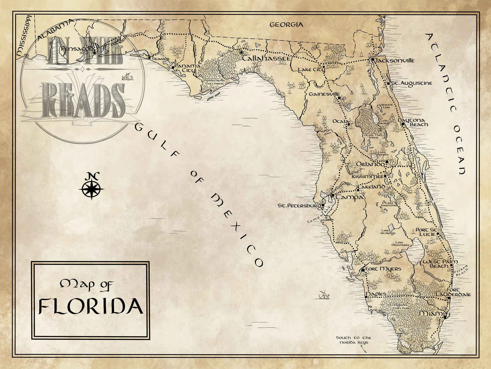

```{r setup, include=FALSE}
usethis::use_git_ignore(c("*.csv", "*.rds"))
options(htmltools.dir.version = FALSE)

library(knitr)
library(tidyverse)
library(xaringan)
library(fontawesome)
```

class: inverse, center, middle

# `r fa("fas fa-images", fill = "#fff")`

**View the slides:** 

[bretsw.com/eme6665-ss23-module1](https://bretsw.com/eme6665-ss23-module1)

---

class: inverse, center, middle

# `r fa("fas fa-door-open", fill = "#fff")` <br><br> Welcome to EME6665!

---

class: inverse, center, middle

# `r fa("fas fa-door-open", fill = "#fff")` <br><br> Introduce yourself:

Name

Preferred pronouns

Research goals (significance, answering "So what?")

Favorite piece of writing (a novel, a poem, song lyrics, a movie quote, etc.)

---

class: inverse, center, middle

# `r fa("fas fa-thumbtack", fill = "#fff")` <br><br> Canvas tour

https://canvas.fsu.edu/courses/227358/

[Syllabus](https://canvas.fsu.edu/courses/227358/assignments/syllabus)

[Assignments](https://canvas.fsu.edu/courses/227358/pages/look-over-course-assignments)

[Learning Objectives](https://canvas.fsu.edu/courses/227358/pages/review-course-objectives)

---

class: inverse, center, middle

# `r fa("fas fa-thumbtack", fill = "#fff")` <br><br> What is "chapter one"?

---

class: inverse, center, middle

# `r fa("fas fa-thumbtack", fill = "#fff")` What is "chapter one"?

<div class="padlet-embed" style="border:1px solid rgba(0,0,0,0.1);border-radius:2px;box-sizing:border-box;overflow:hidden;position:relative;width:100%;background:#F4F4F4"><p style="padding:0;margin:0"><iframe src="https://fsu.padlet.org/embed/qxpbkg8vg12sfrvu" frameborder="0" allow="camera;microphone;geolocation" style="width:100%;height:480px;display:block;padding:0;margin:0"></iframe></p><div style="display:flex;align-items:center;justify-content:end;margin:0;height:28px"><a href="https://padlet.com?ref=embed" style="display:block;flex-grow:0;margin:0;border:none;padding:0;text-decoration:none" target="_blank"><div style="display:flex;align-items:center;"></div></a></div></div>

---

# `r fa("fas fa-thumbtack", fill = "#fff")` Ch. 1: A map of research

```{r, out.width = "680px", echo = FALSE, fig.align = "center"}

```

<div class="caption">
<p><a href="https://www.etsy.com/listing/801221880/florida-map-tolkien-style-free-us" target="_blank">Tolkien-style Florida map available through InTheReads on Etsy</a></p>
</div>

---

# `r fa("fas fa-thumbtack", fill = "#fff")` Ch. 1: Alignment

```{r, out.width = "100%", echo = FALSE, fig.align = "center"}

```

---

class: inverse, center, middle

# `r fa("fas fa-pen", fill = "#fff")` <br><br> Drawing the map

---

class: inverse, center, middle

# `r fa("fas fa-pen", fill = "#fff")` Drawing the map

<div class="padlet-embed" style="border:1px solid rgba(0,0,0,0.1);border-radius:2px;box-sizing:border-box;overflow:hidden;position:relative;width:100%;background:#F4F4F4"><p style="padding:0;margin:0"><iframe src="https://fsu.padlet.org/embed/jbwz0hokd7llz8bf" frameborder="0" allow="camera;microphone;geolocation" style="width:100%;height:480px;display:block;padding:0;margin:0"></iframe></p><div style="display:flex;align-items:center;justify-content:end;margin:0;height:28px"><a href="https://padlet.com?ref=embed" style="display:block;flex-grow:0;margin:0;border:none;padding:0;text-decoration:none" target="_blank"><div style="display:flex;align-items:center;"></div></a></div></div>

<div class="caption">
<p><a href="https://rgbstudios.org/projects/dnd-dice" target="_blank">D&D Dice: D6 + D10</a></p>
</div>

---

class: inverse, center, middle

# `r fa("fas fa-pen", fill = "#fff")` <br><br> Practice drawing the map!

---

class: inverse, center, middle

# `r fa("fas fa-binoculars", fill = "#fff")` <br><br> Looking ahead

---

# `r fa("book-open", fill = "#fff")` Module 1 readings

```{r, out.width = "420px", echo = FALSE, fig.align = "center"}

```

--

- 1.1 Reviewing the Literature: Why? For Whom? How? (Fink, 2020, Chapter 1)

--

- 1.2 Key Takeaways From the Psi Chi Webinar "So You Need to Write a Literature Review" (Greenbaum & Lee, 2022)

--

- 1.3 Scholars before Researchers: On the Centrality of the Dissertation Literature Review in Research Preparation (Boote & Beile, 2005)

--

- 1.4 The Craft of Research, chapters 3-5 (Booth et al., 2016)

---

# `r fa("fas fa-calendar-day", fill = "#fff")` Semester schedule

--

- **Module 1:** Threads of Chapter One

--

- **Module 2:** Do You Trust Me?

--

- **Module 3:** A Handbook's Tale

--

- **Module 4:** Systematic Not Automatic

--

- **Module 5:** Synthesis Over Summary

--

- **Module 6:** Elements of Style (for Academic Writing)

--

- **Module 7:** Weaving Together Chapter One

---

# `r fa("fas fa-calendar-day", fill = "#fff")` Module structure

```{r, out.width = "540px", echo = FALSE, fig.align = "center"}
include_graphics("img/workshop.jpg")
```

--

- `r fa("video", fill = "#782F40")` Meet (Mondays at 9:20am EST, Stone Building #3303)

--

- `r fa("book-open", fill = "#782F40")` Read

--

- `r fa("comments", fill = "#782F40")` Discuss

--

- `r fa("fas fa-keyboard", fill = "#782F40")` Create

---

# `r fa("fas fa-calendar-day", fill = "#fff")` Major Assignments

```{r, out.width = "600px", echo = FALSE, fig.align = "center"}
include_graphics("img/build.jpg")
```

--

- **Discussion** (in class or on Canvas) every module (24%)

--

- **Advisor Checkpoint** in Modules 1, 4, and 7 (6%)

---

# `r fa("fas fa-calendar-day", fill = "#fff")` Major Assignments

```{r, out.width = "260px", echo = FALSE, fig.align = "center"}
include_graphics("img/build.jpg")
```

- **Assignments** (70%)

--

  - Module 1 Assignment: Research Map (100 points)

--

  - Module 2 Assignment: Article Critique (100 points)

--

  - Module 3 Assignment: Topic Reflection (100 points)

--

  - Module 4 Assignment: Analytic Memo (100 points)

--

  - Module 5 Assignment: One Completed Subsection (100 points)

--

  - Module 6 Assignment: Peer Review (50 points)

--

  - Module 7 Assignment: Chapter One Draft One (150 points)

---

class: inverse, center, middle

# `r fa("fas fa-question", fill = "#fff")` <br><br> Questions

<hr>

**What questions can I answer for you now?**

**How can I support you this week?**

<hr>

`r fa("envelope", fill = "#fff")` [bret.staudtwillet@fsu.edu](mailto:bret.staudtwillet@fsu.edu) | `r fa("globe", fill = "#fff")` [bretsw.com](https://bretsw.com) | `r fa("fab fa-github", fill = "#fff")` [GitHub](https://github.com/bretsw/)